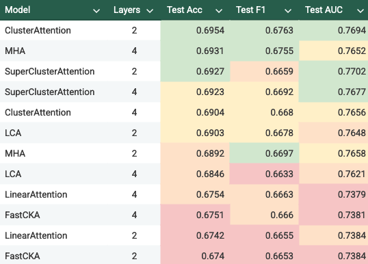
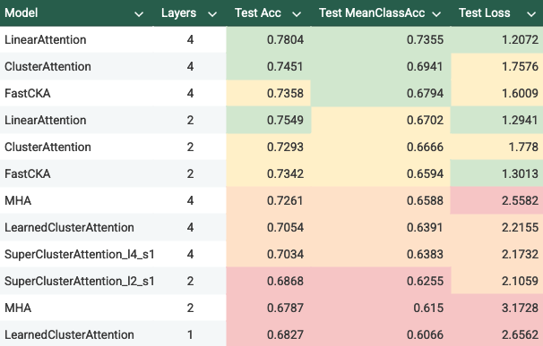

Title: Subquadratic self-attention with clustering

# Introduction

A useful way to reframe self-attention is to interpret it as a graph neural network operating over the complete graph $G=(V,E)$ on $n=|V|$. Every token attends to every other token, which is exactly message passing on a complete graph with self-edges. This is quadratic in the number of tokens, as the number of messages passed is $O(E) = O(n^2)$. Several existing methods reduce this cost that can be categorized as altering the graph structure or the attention kernel. For example:

* **Linear attention.** Replace the softmax kernel with a feature map $\phi(\cdot)$ [2, 3]. Compute $(QK^\top)V$ as $Q(\phi(K)^\top V)$. Cost $O(n d^2)$ instead of $O(n^2 d)$. Quality depends on the kernel approximation.
* **Cluster attention** [6]. Group tokens into clusters. Compute attention inside each cluster plus attention between cluster summaries. Cost depends on the number of clusters $C$. Uses locality-sensitive hashing (LSH) to form clusters based on query-key similarity, achieving $O(n \log n)$ complexity. Reformer [4] combines LSH-based clustering with reversible layers and chunked feed-forward networks to reduce memory usage.
* **Sparse attention.** Replace the complete graph with a sparse adjacency pattern. Sparse Transformers [5] use fixed strided patterns or learned sparsity masks. Longformer [7] and BigBird [8] extend this with sliding windows and global tokens. Cost becomes $O(n \sqrt{n})$ to $O(n)$ or better depending on the schedule.

This blog develops a sequence of architectures centered on clustering, motivated by graph neural networks. Our work culminates in two main directions:
 
1. `SuperClusterAttention` an attention mechanism that restricts self-attention to within learned clusters and uses supernodes to route information between clusters.
2. `ClusterKernelAttention`, a hybrid that combines linear attention on top of cluster structure. 

We apply these architectures to three domains: language modeling (enwik8), physics regression (HEP events), and 3D object recognition (modelnet). 

We hypothesize that these proposed techniques are particularly effective when the underlying data exhibit latent cluster structure, making clustering an appropriate inductive bias.

# Proposed Architectures

## SuperClusterAttention

SuperClusterAttention replaces full self-attention with a two–stage process that first routes information through a set of cluster “supernodes” and then performs local attention inside each cluster. The steps are:

1. Tokens are assigned to $C$ clusters.
2. Each cluster produces a supernode, defined by a learned aggregation of its members. The supernodes attend to each other (a $C×C$ complete graph). The resulting messages are then broadcast back to tokens using the same cluster weights
3. Each cluster runs self-attention within itself. 

Every token receives local information from its cluster and global information routed through its supernode, which is 

### Cluster Assignment

To remain permutation-equivariant with respect to token order, we must use a permutation-invariant rule to assign tokens to clusters. A simple approach based on sorting token scores gives contiguous blocks in $O(n \log⁡ n)$, but sorting is non-differentiable and breaks end-to-end training of the cluster projection.

1. Project each token to a scalar.
2. Sort the sequence of scalars.
3. Split the sorted sequence into $C$ contiguous blocks, representing cluster assignments.

However, the sorting and partitioning step is not differentiable, making backprop unable to reach the learned cluster embedding. Instead, we use the "straight through trick":

1. Project each token into $C$ logits and apply a softmax to obtain soft cluster memberships `R_soft`.
2. Take an argmax over those logits to produce hard assignments `R_hard`.
3. Combine the two with a straight-through estimator:
   `R = R_hard.detach() - R_soft.detach() + R_soft`
   This keeps clustering discrete in the forward pass while allowing gradients to flow through the soft assignments.

### Supernode construction
Each cluster produces a supernode that summarizes its tokens before participating in  We define its feature vector as a learned linear pool over the cluster, with the softmax probabilities coming from `R_soft` in the cluster assignment step.

### Remarks
- The supernode technique is not compatible with causal masking because it mixes information across all positions.
- For comparison, we include two ablations that do support causal masking:
  +  `LearnedClusterAttention`, which keeps the learned cluster assignments but removes supernodes, preventing inter-cluster communication.
  +  `ClusterAttention`, which uses the original sort-based cluster assignment procedure.
- In all cases we treat each cluster as a fully connected subgraph (standard self-attention), though other intra-cluster graph structures can be explored and may be domain specific.

## ClusterKernelAttention
`ClusterKernelAttention` replaces full token–token attention with kernel attention routed through soft clusters. Each token contributes its kernelized keys and values to the clusters it belongs to, clusters maintain running summaries, and tokens read back a cluster-conditioned context.

The procedure is as follows:
1. Tokens obtain soft cluster memberships through a learned projection and temperatured softmax.
2. Queries, keys, and values are mapped through a positive kernel feature map so linear attention applies.
3. Each cluster accumulates prefix sums of kernelized keys and key–value products (causal masking preserved).
4. Cluster states are mixed through a learned low-rank transformation so information flows across clusters without paying a full $C^2$ cost.
5. Tokens read back a mixed cluster summary using their soft assignments and form a standard linear-attention update.

For a more detailed mechanism and full code, refer to the Appendix [#TODO link appendix] and [GitHub repo](https://github.com/rynchin/clusterattention/blob/master/variants/ClusterKernelAttention.py).

### FastCKA variant
FastCKA implements the same update but reorganizes the algebra so that most operations happen in the reduced rank. This removes large intermediate cluster tensors and lowers matmul cost, resulting in an observed 2× training speed improvement while producing the same outputs.

### Remarks
* Soft assignments keep routing differentiable without straight-through. 
* The mixing rank $k$ controls how much cross-cluster information is exchanged.
* We utilize cluster mixing as sequences often contain latent groups or repeated local patterns that benefit from shared cluster summaries.

# Experiments

We test whether reduced complexity harms accuracy across domains with very different structure. We evaluate on three domains with different sequence statistics:

- **Language modeling (enwik8).** Long byte sequences with causal prediction. We report bits-per-byte under a shared training budget.
- **High-energy physics jets.** Variable-length particle sequences with full-context binary classification. We report Accuracy, F1, and AUC.
- **ModelNet40.** Fixed-size 3D point clouds with full-context multi-class classification. We report overall Accuracy and mean-class Accuracy.

All models use the same training schedules within each domain.

# Results

## Language Modeling Results

We evaluate our architectures on the enwik8 character-level language modeling task. All models are trained with causal masking, using the same hyperparameters (batch size 32, learning rate $3 \times 10^{-4}$).

### Main Results (50,000 steps)

Table 1 shows validation bits-per-byte (bpb) for different architectures across varying layer depths:

| Architecture | Layers | Val bpb | Notes |
|--------------|--------|---------|-------|
| MHA | 1 | 2.13 | Baseline |
| MHA | 4 | 1.56 | Baseline |
| MHA | 8 | 1.48 | Baseline (best) |
| LinearAttention | 1 | 2.30 | Linear kernel |
| LinearAttention | 4 | 1.74 | Linear kernel |
| LinearAttention | 8 | 1.61 | Linear kernel |
| CKA | 1 | 2.29 | Cluster + linear |
| CKA | 4 | 1.72 | Cluster + linear |
| CKA | 8 | 1.58 | Cluster + linear |

CKA shows minimal improvement over linear attention

### Cluster Scale Ablation (20,000 steps)

We investigate how the number of clusters of `ClusterAttention` affects performance by varying the cluster scale parameter $s$ where $C = s \cdot \sqrt{n}$. Results for 2-layer models:

| Cluster Scale | C (approx) | ClusterAttention Val bpb | LCA Val bpb | CKA Val bpb |
|---------------|------------|--------------------------|-------------|-------------|
| 1 | ~23 | 3.72 | 3.71 | 2.36 |
| 2 | ~45 | 3.59 | - | 2.39 |
| 4 | ~91 | 3.41 | 3.42 | 2.34 |
| 6 | ~136 | 3.24 | - | - |
| 8 | ~181 | 3.09 | - | 2.38 |
| 16 | ~362 | 2.54 | - | - |
| 32 | ~724 | 1.88 | - | - |
| 64 | ~1448 | 1.90 | - | - |

## High-Energy Physics Jet Tagging Results

We evaluate our architectures on the HEP jet tagging task. All models are trained for 20,000 steps with noncausal attention (full event context available). Table 2 shows test set performance metrics, sorted by test accuracy:

<!-- | Model                   | Layers | Test Acc | Test F1 | Test AUC |
| ----------------------- | ------ | -------- | ------- | -------- |
| MHA                     | 4      | 0.6931   | 0.6755  | 0.7652   |
| SuperClusterAttention   | 2      | 0.6927   | 0.6659  | 0.7702   |
| SuperClusterAttention   | 4      | 0.6923   | 0.6692  | 0.7677   |
| LearnedClusterAttention | 2      | 0.6903   | 0.6678  | 0.7648   |
| MHA                     | 2      | 0.6892   | 0.6697  | 0.7658   |
| LearnedClusterAttention | 4      | 0.6846   | 0.6633  | 0.7621   | -->

Caption: Green, yellow, orange, and red highlight successive performance rankings in each column, with green marking the top three values, yellow the next three, and so on.

## ModelNet40 Results

We evaluate our architectures on the ModelNet40 3D object classification task. All models are trained for 20,000 steps with noncausal attention. Table 3 shows test set performance metrics, sorted by test accuracy:

<!-- | Model                 | Layers | Test Acc | Test MeanClassAcc |
| --------------------- | ------ | -------- | ----------------- |
| LinearAttention       | 4      | 0.7804   | 0.7355            |
| LinearAttention       | 2      | 0.7549   | 0.6702            |
| FastCKA               | 2      | 0.7342   | 0.6594            |
| FastCKA               | 4      | 0.7358   | 0.6794            |
| ClusterAttention      | 4      | 0.7451   | 0.6941            |
| ClusterAttention      | 2      | 0.7293   | 0.6666            |
| MHA                   | 4      | 0.7261   | 0.6588            |
| SuperClusterAttention | 4      | 0.7034   | 0.6383            |
| SuperClusterAttention | 2      | 0.6868   | 0.6255            |
|LearnedClusterAttention| 4      | 0.7054   | 0.6391            |
|LearnedClusterAttention| 2      | 0.6827   | 0.6066            |
| MHA                   | 2      | 0.6787   | 0.6150            |
 -->
 

Caption: Green, yellow, orange, and red highlight successive performance rankings in each column, with green marking the top three values, yellow the next three, and so on.

# Discussion
Among efficient attention methods focused on reducing quadratic cost, our results suggest that clustering offers a structurally different route than kernel-only or sparsity-only approaches. CKA shows that simply routing through soft clusters and applying a positive feature map is enough to obtain a subquadratic update without resorting to hard partitioning or LSH. In particular, by keeping assignments soft and using low-rank mixing, we retain differentiability while still moving information across clusters at a cost that scales like $T^{3/2}$.

This leads us to believe that future work on efficient attention should focus less on approximating the softmax kernel alone, and more on structuring communication paths in ways that reflect latent organization of the data. Linear attention and Performer-style kernels already do an excellent job when every token interacts globally, but they do not encourage information flow through intermediate routes. Clustering also encourages a communication pattern that may become increasingly valuable as sequence lengths scale well beyond current limits.

On enwik8, CKA behaves much like linear attention, and on HEP and ModelNet40 gains are modest under limited training budgets. Yet these domains have relatively short or fixed lengths, meaning that the quadratic bottleneck is less pressing and latent cluster structure is only weakly expressed. The promise of CKA is therefore not fully tested in these settings.

Next, we examine the performance of SuperClusterAttention (SCA) and its ablations (LCA and CA). The ablations perform very poorly on language modeling, indicating that clusters do not provide useful structure in that domain. SCA shows high performance on the HEP task, with comparatively poor performance from LCA. This contrast suggests that the relevant physics signal relies on information flow across clusters that is expressed only in SCA. On the contrary, we were intrigued by the high performance of CA. Since it uses only simple, fixed partitions, this suggests that some of the relevant signal is accessible even without learned clustering. It also indicates that we do not yet fully understand which parts of the clustering mechanism matter most for HEP, and that further analysis is needed.

SCA and its ablations perform poorly on ModelNet40. Routing through a supernode and restricting attention to clusters may interfere with how the 3D structure is represented. Unlike the HEP task, where global mixing appears helpful, 3D recognition seems more sensitive to how local spatial cues are preserved. Further investigation is needed to understand the exact failure mode.

<!-- // TODO elaborate on acronyms-->

# Conclusion
Our study indicates that reducing attention costs through clustering is feasible without collapsing performance at the scales we tested. SuperClusterAttention and ClusterKernelAttention approach the same goal with different mechanisms: one inserts explicit supernodes for global exchange, the other replaces dense token interactions with soft cluster routing combined with linear kernels and low-rank mixing. In both cases, information still travels globally, but the path is mediated by a much smaller set of cluster states.

That said, the overall picture is mixed, and our results should be interpreted cautiously. Performance varies sharply by domain, underscoring the need for domain-specific analyses before drawing broader conclusions.

Moving forward, we would like to see attention mechanisms that adapt the number of clusters, learn hierarchical cluster structure across layers, or incorporate priors that encourage meaningful routing without manual tuning.

# References

1. Vaswani, A., et al. "Attention is all you need." NeurIPS 2017.
2. Katharopoulos, A., et al. "Transformers are RNNs: Fast autoregressive transformers with linear attention." ICML 2020.
3. Choromanski, K., et al. "Rethinking attention with performers." ICLR 2021.
4. Kitaev, N., Kaiser, Ł., & Levskaya, A. "Reformer: The efficient transformer." ICLR 2020.
5. Child, R., Gray, S., Radford, A., & Sutskever, I. "Generating long sequences with sparse transformers." arXiv:1904.10509, 2019.
6. Rae, J. W., & Razavi, A. "Do transformers need deep long-range memory?" arXiv:2007.04825, 2020.
7. Beltagy, I., Peters, M. E., & Cohan, A. "Longformer: The long-document transformer." arXiv:2004.05150, 2020.
8. Zaheer, M., et al. "Big bird: Transformers for longer sequences." NeurIPS 2020.

# Appendix
## ClusterKernelAttention Derivation
ClusterKernelAttention replaces full token–token attention with kernel attention routed through soft clusters. Each token contributes its kernelized keys and values to the clusters it belongs to, clusters maintain running summaries, and tokens read back a cluster-conditioned context.

The procedure is as follows:
1. **Soft cluster assignment.**  
   Each token $x_i \in \mathbb{R}^d$ is projected to cluster logits 
   $$ z_i = W_c x_i \in \mathbb{R}^C $$
   and converted to soft assignments
$$
   a_{i,c} = \mathrm{softmax}\!\left(\frac{z_i}{\tau}\right)_c,\qquad \sum_{c=1}^C a_{i,c} = 1.
$$

2. **Kernel projection.**  
   Queries, keys, and values are computed per token,
$$ Q_i = \phi(W_Q x_i),\qquad
   K_i = \phi(W_K x_i),\qquad
   V_i = W_V x_i, $$
where $\phi(\cdot)$ is a positive feature map (we utilized $\phi(x)=\mathrm{ELU}(x)+1$).

3. **Cluster accumulation.**  
   Each cluster $c$ maintains running sums of kernelized keys and key–value products,
$$
   K_{c}^{(t)} = \sum_{i \le t} a_{i,c}K_i,\qquad
   S_{c}^{(t)} = \sum_{i \le t} a_{i,c}K_iV_i.
$$
   With causal masking these are prefix sums so position $t$ only sees positions $i \le t$.

4. **Cluster mixing.**  
   Cluster states are mixed through a learned low-rank transformation
$$
   M \approx AB^\top,\qquad A,B \in \mathbb{R}^{C \times k},
$$
   and we form
$$
   \tilde{K}_{c}^{(t)} = \sum_{c'=1}^C M_{c,c'}K_{c'}^{(t)},\qquad
   \tilde{S}_{c}^{(t)} = \sum_{c'=1}^C M_{c,c'}S_{c'}^{(t)}.
$$
   This moves information across clusters without a full $C^2$ cost.
   For $C \approx \sqrt{T}$, the dominant work scales as $T^{3/2}$, maintaining subquadratic attention.

5. **Token readout.**  
   Tokens read from the mixed cluster states using their soft assignments,
$$
   K_i^\ast = \sum_{c=1}^C a_{i,c}\tilde{K}_{c}^{(t)},\qquad
   S_i^\ast = \sum_{c=1}^C a_{i,c}\tilde{S}_{c}^{(t)},
$$
   and the final output is
$$
   h_i = \frac{Q_i^\top S_i^\ast}{Q_i^\top K_i^\ast}.
$$
   as similarly done in [Performer](https://arxiv.org/abs/2009.14794).

**Complexity.**  
Mixing avoids a full $C^2$ transformation. For $C \approx \sqrt{T}$, the dominant work scales as $T^{3/2}$ instead of $T^2$.
